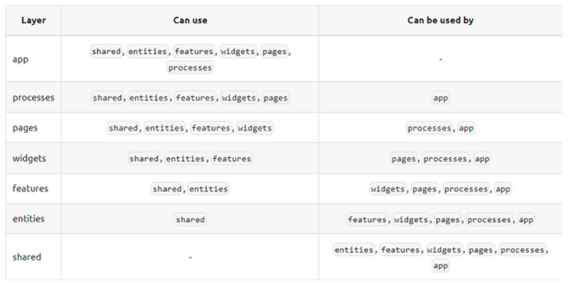

### Планы
- [x] нужно добавить роутинг
- [ ] мб добавить редирект на все кроме /board
- [ ] подумать над loader и errorElement в роуте
- [ ] мб добавить страницу 404
- [ ] мб добавить страницу авторизации? 
- [ ] сделать страницу ошибки с описанием ошибки
- [ ] добавить фичу по созданию туду (не пустой текст)
- [ ] фича по удалению туду 
- [ ] фича по добавлению колонки
- [ ] dnd перенос туду в следующую колонку
- [ ] редактирование туду по клику на нее
- [x] переписать структуру на FSD
- [x] обновить витест до последней версии 1.4.0
- [ ] получать туду из какой-нибудь апишки
- [x] установить конфиг для ESLint — @feature-sliced/eslint-config
- [x] добавить алиас для shared
- [x] добавить тесты при коммитах
- [ ] подумать, мб использовать эффектор
- [ ] подумать, мб использовать реакт квери
- [ ] пагинация в туду

будущий апи https://dummyjson.com/ или https://jsonplaceholder.typicode.com/